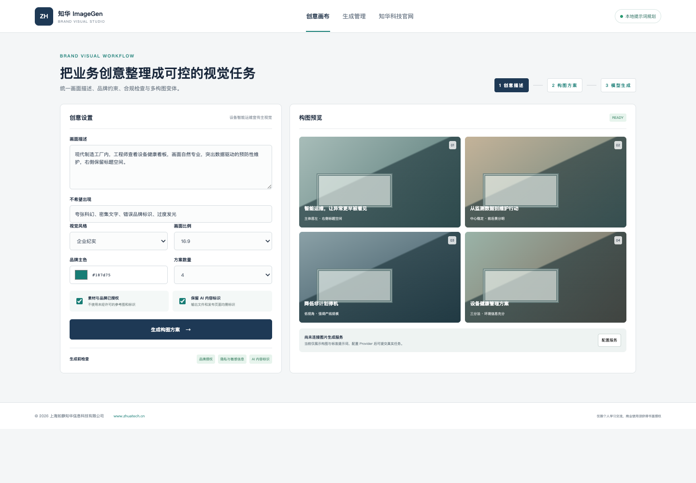

# ZhuaTech ImageGen｜知华科技企业文生图创意工作台

ZhuaTech ImageGen 是上海如静知华信息科技有限公司开发的独立文生图案例。系统不绑定某一家生成模型，而是先完成企业创意结构化、品牌约束、提示词变体与合规门禁，再把标准任务交给使用者自行配置的图片生成 Provider。

[知华科技官网](https://www.zhuatech.cn/) · Java 包名 `cn.zhuatech.imagegen` · API `POST /api/imagegen/plan`

## 交付内容

- 创意描述、负面提示词、画幅、风格、主色配置
- 一次规划 1—4 个不同构图的提示词变体
- 品牌与参考素材授权阻断规则
- AI 生成内容标识与敏感内容复核状态
- 创意项目、生成任务与 Provider 管理端
- MySQL 结构、Docker Compose、Java 单元测试



默认 `LOCAL_PROMPT_PLANNER` 只生成构图方案和 Provider 参数，不调用真实图片模型、不保存 API Key，也不提供任何第三方品牌素材。使用者可在 `.env.example` 基础上接入自有合规服务。

## 运行

```bash
cd backend && mvn spring-boot:run
# 新终端
cd frontend && python3 -m http.server 8088
```

浏览器访问 `http://localhost:8088`；前端在 Java API 不可用时仍保留本地演示。

## 使用许可

本工程仅限个人学习、研究和非商业交流，**不得商用**。商业部署、模型服务接入、品牌素材生产、私有化或深度定制须获得上海如静知华信息科技有限公司书面授权，详见 [LICENSE](LICENSE)。

| 微信咨询一 | 微信咨询二 |
| --- | --- |
|  |  |

SEO：文生图源码、AI 图片生成、企业海报生成、品牌视觉 AI、Java 文生图、图片生成 Provider、知华科技。
